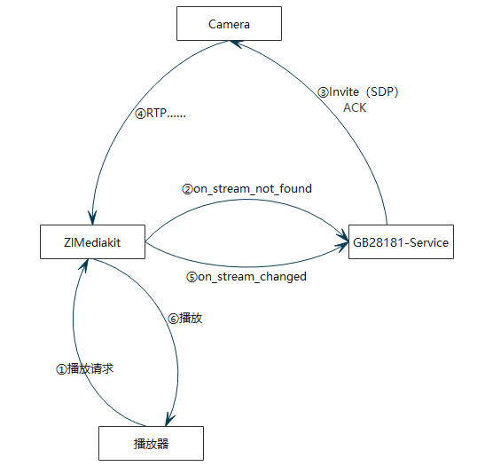

# GB28181-Service

[](https://github.com/Washington-DC/GB28181-Service/actions/workflows/cmake-ubuntu.yml)   [](https://github.com/Washington-DC/GB28181-Service/actions/workflows/msbuild-windows.yml)


依赖[ZLMediaKit](https://github.com/ZLMediaKit/ZLMediaKit)实现的一个简单的GB28181服务器。

因eXosip2使用epoll，Windows下SipService只支持UDP，Linux下支持TCP和UDP。[SipClinet](SipClient/README.md)，用于模拟一个GB28181设备。


## 实现功能

 -  国标摄像头注册接入、目录查询、推流。
    
 -  云台控制、预置位调用，参考Http接口部分。

 -  实现部分zlm的webhook接口，以实现按需推流功能。客户端拉流时推送视频，无人观看时，自动关闭。

 -  sqlite数据保存。

 -  设置设备和通道的Nickname，修改设备收流IP。

 -  录像文件查询和回放。

 -  单端口模式收流和多端口模式收流适配。单端口模式下，流地址是SSRC信息，所以这里对每个Channel初始化时就设置一个固定的SSRC（通过defaultStreamID获取ssrc对应的streamID）。多端口模式下，使用device_id和channel_id组合作为streamID。
    
    如设备ID: `34020000002000000001`,通道ID: `34020000002000000012`,系统初始化SSRC: `0200000000`。单端口模式下，可以用`rtsp://127.0.0.1:554/rtp/0BEBC200`地址播放，其中`0BEBC200`则为SSRC的16进制标识。多端口模式下，则使用`rtsp://127.0.0.1:554/rtp/34020000002000000001_34020000002000000012`。当然也可用ZLMediaKit支持的其他各种协议格式。
    
    具体内容可以参考[GB28181怎么用设备ID作为流ID · ZLMediaKit/ZLMediaKit Wiki (github.com)](https://github.com/ZLMediaKit/ZLMediaKit/wiki/GB28181怎么用设备ID作为流ID)



## 待实现

 - 语音对讲

 - ...


 ## 编译安装

 参考 [Install.md](Install.md)


## 依赖库：

 - [boost](https://github.com/boostorg/boost)
 - [osip](https://www.gnu.org/software/osip/osip.html)
 - [eXosip2](http://savannah.nongnu.org/projects/exosip)
 - [ZLToolKit](https://github.com/ZLMediaKit/ZLToolKit)
 - [openssl](https://github.com/openssl/openssl)
 - [curl](https://github.com/curl/curl)
 - [cpr](https://github.com/libcpr/cpr)
 - [spdlog](https://github.com/gabime/spdlog)
 - [crow](https://github.com/CrowCpp/Crow)
 - [nlohmann/json](https://github.com/nlohmann/json)
 - [pugixml](https://github.com/zeux/pugixml)
 - [magic_enum](https://github.com/Neargye/magic_enum)
 - [sqlite](https://github.com/sqlite/sqlite)
 - [sqlite3pp](https://github.com/iwongu/sqlite3pp)


## WebHook接口

 端口为配置文件中Http端口。
 - on_publish=http://127.0.0.1:8000/index/hook/on_publish
 - on_stream_changed=http://127.0.0.1:8000/index/hook/on_stream_changed
 - on_stream_none_reader=http://127.0.0.1:8000/index/hook/on_stream_none_reader
 - on_stream_not_found=http://127.0.0.1:8000/index/hook/on_stream_not_found
 - on_server_keepalive=http://127.0.0.1:8000/index/hook/on_server_keepalive
 - on_rtp_server_timeout=http://127.0.0.1:8000/index/hook/on_rtp_server_timeout


## 配置文件说明

```xml
<?xml version="1.0" encoding="utf-8" ?>
<Config>
	<SipServer>
		<!-- SIP监听端口 -->
		<Port>5060</Port>
		<Password>12345678</Password>
		<!-- SIP服务ID -->
		<ID>34020000002000000001</ID>
		<!-- 这个参数暂时没用 -->
		<IP>0.0.0.0</IP>
		<!-- 收流IP -->
		<ExternIP>192.168.116.125</ExternIP>
	</SipServer>
	<MediaServer>
		<!-- ZLM服务地址 -->
		<IP>127.0.0.1</IP>
		<!-- ZLM服务Http端口 -->
		<Port>10070</Port>
		<!-- ZLM RTP接收端口 -->
		<RtpPort>10000</RtpPort>
		<!-- ZLM是否使用单端口模式 -->
		<SinglePortMode>true</SinglePortMode>
		<Secret>035c73f7-bb6b-4889-a715-d9eb2d1925cc</Secret>
	</MediaServer>
	<Http>
		<!-- Http服务端口 -->
		<Port>8000</Port>
	</Http>
</Config>
```


## 接口列表

### 1、`/v1/device/list`

- 功能：获取设备列表

- 范例：[http://127.0.0.1:8000/v1/device/list](http://127.0.0.1:8000/v1/device/list)

- 参数：无

- 响应：
```json
{
    "code": 0,
    "data": [
        {
            "channel_count": 1,
            "id": "34020000001320000100",
            "ip": "192.168.116.200",
            "last_time": "2023-06-26 15:24:04",
            "manufacturer": "Hikvision",
            "name": "IP DOME",
            "nickname": "IP DOME",
            "port": "5060",
            "protocol": "UDP",
            "regist_time": "2023-06-26 15:23:59",
            "status": 1,
            "stream_ip": "192.168.116.125"
        }
    ],
    "msg": "ok"
}
```


### 2、`/v1/device`

- 功能：获取某个设备信息

- 范例：[http://127.0.0.1:8000/v1/device?device_id=34020000001320000100](http://127.0.0.1:8000/v1/device?device_id=34020000001320000100)

- 参数：

    |   参数    | 是否必选 |   释意   |
    | :-------: | :------: | :------: |
    | device_id |    Y     | 设备编码 |


- 响应：
```json
{
    "code": 0,
    "data": {
        "channel_count": 1,
        "id": "34020000001320000100",
        "ip": "192.168.116.200",
        "last_time": "2023-06-26 15:28:39",
        "manufacturer": "Hikvision",
        "name": "IP DOME",
        "nickname": "IP DOME",
        "port": "5060",
        "protocol": "UDP",
        "regist_time": "2023-06-26 15:23:59",
        "status": 1,
        "stream_ip": "192.168.116.125"
    },
    "msg": "ok"
}
```


### 3、`/v1/channel/list`

- 功能：获取某个设备的所有通道信息

- 范例：[http://127.0.0.1:8000/v1/channel/list?device_id=34020000001320000100](http://127.0.0.1:8000/v1/channel/list?device_id=34020000001320000100)

- 参数：

    |   参数    | 是否必选 |   释意   |
    | :-------: | :------: | :------: |
    | device_id |    Y     | 设备编码 |


- 响应：
```json
{
    "code": 0,
    "data": [
        {
            "id": "34020000001320000100",
            "manufacturer": "Hikvision",
            "model": "IP Camera",
            "name": "IPdome",
            "nickname": "IPdome",
            "ptz_type": "",
            "ssrc": "0200000000",
            "status": "ON",
            "stream_id": "0BEBC200",
            "sub_channel_count": 0
        }
    ],
    "msg": "ok"
}
```


### 4、`/v1/channel`

- 功能：获取某个设备的某个通道的信息

- 范例：[http://127.0.0.1:8000/v1/channel/list?device_id=34020000001320000100&channel_id=34020000001320000100](http://127.0.0.1:8000/v1/channel/list?device_id=34020000001320000100&channel_id=34020000001320000100)

- 参数：

    |    参数    | 是否必选 |   释意   |
    | :--------: | :------: | :------: |
    | device_id  |    Y     | 设备编码 |
    | channel_id |    Y     | 通道编码 |


- 响应：
```json
{
    "code": 0,
    "data": [
        {
            "id": "34020000001320000100",
            "manufacturer": "Hikvision",
            "model": "IP Camera",
            "name": "IPdome",
            "nickname": "IPdome",
            "ptz_type": "",
            "ssrc": "0200000000",
            "status": "ON",
            "stream_id": "0BEBC200",
            "sub_channel_count": 0
        }
    ],
    "msg": "ok"
}
```


### 5、`/v1/play/start`

- 功能：点播某个通道数据

- 范例：[http://127.0.0.1:8000/v1/play/start?device_id=34020000001320000100&channel_id=34020000001320000100](http://127.0.0.1:8000/v1/play/start?device_id=34020000001320000100&channel_id=34020000001320000100)

- 参数：

    |    参数    | 是否必选 |   释意   |
    | :--------: | :------: | :------: |
    | device_id  |    Y     | 设备编码 |
    | channel_id |    Y     | 通道编码 |


- 响应：

如果超时会返回
```json
{
    "code": 400,
    "data": "",
    "msg": "timeout"
}
```


正常则会返回
```json
{
    "code": 0,
    "data": {
        "ssrc": "0200000001"
    },
    "msg": "ok"
}
```


### 6、`/v1/play/stop`

- 功能：停止点播

- 范例：[http://127.0.0.1:8000/v1/play/stop?device_id=34020000001320000100&channel_id=34020000001320000100](http://127.0.0.1:8000/v1/play/stop?device_id=34020000001320000100&channel_id=34020000001320000100)

- 参数：

    |    参数    | 是否必选 |   释意   |
    | :--------: | :------: | :------: |
    | device_id  |    Y     | 设备编码 |
    | channel_id |    Y     | 通道编码 |


- 响应：
```json
{
    "code": 0,
    "data": "",
    "msg": "ok"
}
```


### 7、`/v1/play/stopall`

- 功能：停止所有视频推流

- 范例：[http://127.0.0.1:8000/v1/play/stopall](http://127.0.0.1:8000/v1/play/stopall)

- 参数：无

- 响应：
```json
{
    "code": 0,
    "data": "",
    "msg": "ok"
}
```


### 8、`/v1/set/device/streamip`

- 功能：设置设备的收流IP地址

- 范例：[http://127.0.0.1:8000/v1/set/device/streamip?device_id=34020000001320000100](http://127.0.0.1:8000/v1/set/device/streamip?device_id=34020000001320000100)

- 参数：

    |   参数    | 是否必选 |   释意   |
    | :-------: | :------: | :------: |
    | device_id |    Y     | 设备编码 |


- 响应：
```json
{
    "code": 0,
    "data": "",
    "msg": "ok"
}
```


### 9、`/v1/set/device/nickname`

- 功能：设置设备的自定义名称

- 范例：[http://127.0.0.1:8000/v1/set/device/nickname?device_id=34020000001320000100&nickname=test](http://127.0.0.1:8000/v1/set/device/nickname?device_id=34020000001320000100&nickname=test)

- 参数：

    |   参数    | 是否必选 |    释意    |
    | :-------: | :------: | :--------: |
    | device_id |    Y     |  设备编码  |
    | nickname  |    Y     | 自定义名称 |


- 响应：
```json
{
    "code": 0,
    "data": "",
    "msg": "ok"
}
```


### 10、`/v1/set/channel/nickname`

- 功能：设置通道的自定义名称

- 范例：[http://127.0.0.1:8000/v1/set/device/nickname?device_id=34020000001320000100&channel_id=34020000001320000100&nickname=test](http://127.0.0.1:8000/v1/set/device/nickname?device_id=34020000001320000100&channel_id=34020000001320000100&nickname=test)

- 参数：

    |    参数    | 是否必选 |    释意    |
    | :--------: | :------: | :--------: |
    | device_id  |    Y     |  设备编码  |
    | channel_id |    Y     |  通道编码  |
    |  nickname  |    Y     | 自定义名称 |


- 响应：
```json
{
    "code": 0,
    "data": "",
    "msg": "ok"
}
```


### 11、`/v1/defaultStreamID`

- 功能：获取通道的默认的StreamID，用于在单端口模式下，对视频进行按需推流或播放

- 范例：[http://127.0.0.1:8000/v1/defaultStreamID?device_id=34020000001320000100&channel_id=34020000001320000100](http://127.0.0.1:8000/v1/defaultStreamID?device_id=34020000001320000100&channel_id=34020000001320000100)

- 参数：

    |    参数    | 是否必选 |   释意   |
    | :--------: | :------: | :------: |
    | device_id  |    Y     | 设备编码 |
    | channel_id |    Y     | 通道编码 |


- 响应：
```json
{
    "code": 0,
    "data": {
        "ssrc": "0200000001"
    },
    "msg": "ok"
}
```


### 12、`/v1/preset`

- 功能：预置位设置、调用、删除

- 范例：[http://127.0.0.1:8000/v1/preset?device_id=34020000001320000100&channel_id=34020000001320000100&preset=1&command=goto](http://127.0.0.1:8000/v1/preset?device_id=34020000001320000100&channel_id=34020000001320000100&preset=1&command=goto)

- 参数：

    |    参数    | 是否必选 |        释意        |
    | :--------: | :------: | :----------------: |
    | device_id  |    Y     |      设备编码      |
    | channel_id |    Y     |      通道编码      |
    |   preset   |    Y     |     预置位编号     |
    |  command   |    Y     | 命令：set/goto/del |


- 响应：
```json
{
    "code": 0,
    "data": "",
    "msg": "ok"
}
```


### 13、`/v1/preset/query`

- 功能：查询设备预置位，返回预置位列表

- 范例：[http://127.0.0.1:8000/v1/preset/query?device_id=34020000001320000100&channel_id=34020000001320000100](http://127.0.0.1:8000/v1/preset/query?device_id=34020000001320000100&channel_id=34020000001320000100)

- 参数：

    |    参数    | 是否必选 |   释意   |
    | :--------: | :------: | :------: |
    | device_id  |    Y     | 设备编码 |
    | channel_id |    Y     | 通道编码 |

- 响应：
```json
{
    "code": 0,
    "data": [
        {
            "id": "1",
            "name": "预置点 1"
        },
        {
            "id": "2",
            "name": "预置点 2"
        },
        {
            "id": "3",
            "name": "预置点 3"
        }
    ],
    "msg": "ok"
}
```


### 14、`/v1/ptz`

- 功能：设备云台操作

- 范例：[http://127.0.0.1:8000/v1/ptz?device_id=34020000001320000100&channel_id=34020000001320000100&speed=1&command=stop](http://127.0.0.1:8000/v1/ptz?device_id=34020000001320000100&channel_id=34020000001320000100&speed=1&command=stop)

- 参数：

    |    参数    | 是否必选 |                             释意                             |
    | :--------: | :------: | :----------------------------------------------------------: |
    | device_id  |    Y     |                           设备编码                           |
    | channel_id |    Y     |                           通道编码                           |
    |   speed    |    Y     |     云台速度。zoomin和zoomout时，固定为1，不使用此参数。     |
    |  command   |    Y     | 命令：left,right,up,down,upleft,upright,downleft,downright,zoomin,zoomout,stop |


### 15、`/v1/record/query`

- 功能：录像文件查询

- 范例：[http://127.0.0.1:8000/v1/record/query?device_id=34020000001320000100&channel_id=34020000001320000100&start_time=1679674800
&end_time=1679774800](http://127.0.0.1:8000/v1/record/query?device_id=34020000001320000100&channel_id=34020000001320000100&start_time=1679674800
&end_time=1679774800)

- 参数：

    |    参数    | 是否必选 |                             释意                             |
    | :--------: | :------: | :----------------------------------------------------------: |
    | device_id  |    Y     |                           设备编码                           |
    | channel_id |    Y     |                           通道编码                           |
    | start_time    |    Y     |     开始时间     |
    | end_time   |    Y     | 结束时间 |


### 16、`/v1/record/play/start`

- 功能：录像回放

- 范例：[http://127.0.0.1:8000/v1/record/play/start?device_id=34020000001320000100&channel_id=34020000001320000100&start_time=1679674800&end_time=1679774800](http://127.0.0.1:8000/v1/record/query?device_id=34020000001320000100&channel_id=34020000001320000100&start_time=1679674800&end_time=1679774800)

- 参数：

    |    参数    |  是否必选  |     释意    |
    | :--------: | :------: | :--------: |
    | device_id  |    Y     |   设备编码   |
    | channel_id |    Y     |   通道编码   |
    | start_time |    Y     | 录像开始时间 |
    |  end_time  |    Y     | 录像结束时间 |


### 17、`/v1/record/play/stop`

- 功能：停止录像回放

- 范例：[http://127.0.0.1:8000/v1/record/play/stop?device_id=34020000001320000100&channel_id=34020000001320000100&start_time=1679674800&end_time=1679774800](http://127.0.0.1:8000/v1/record/play/stop?device_id=34020000001320000100&channel_id=34020000001320000100&start_time=1679674800&end_time=1679774800)

- 参数：

    |    参数    |  是否必选  |     释意    |
    | :--------: | :------: | :--------: |
    | device_id  |    Y     |   设备编码   |
    | channel_id |    Y     |   通道编码   |
    | start_time |    Y     | 录像开始时间 |
    |  end_time  |    Y     | 录像结束时间 |
